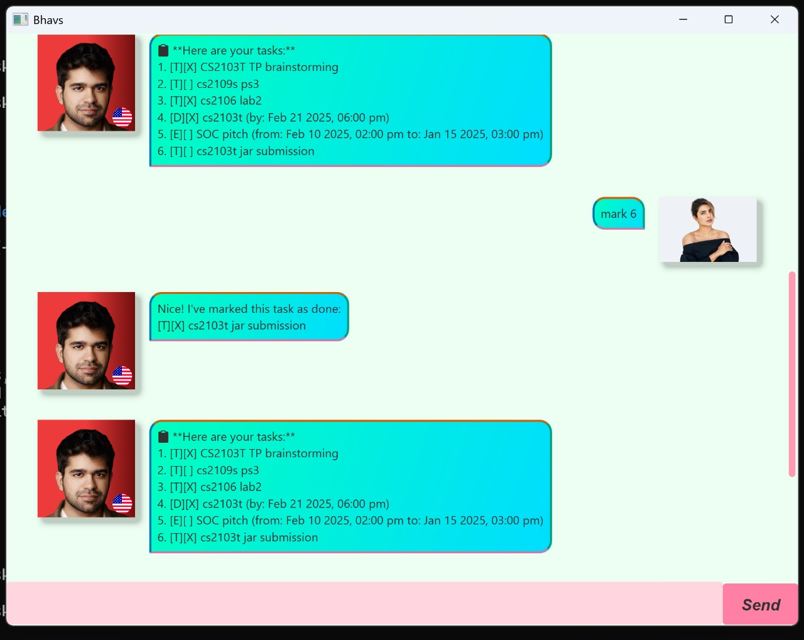

# Bhavs



---

## **1. Introduction**
Bhavs is a chatbot that helps users efficiently track your to-dos, deadlines, and events through simple commands.
It allows users to create task lists, mark tasks as complete, delete tasks, and save progress.

---

## **2. Features & Commands**

### **2.1 Viewing Your Task List**
Displays all the tasks currently stored.

**Usage:**
```
list
```
**Expected Output:**
```
Here are your tasks:
1. [T] DO CS2103T Jar submission
2. [D] Submit assignment CS2109s (by: 2025-05-10 23:59)
3. [E] Team meeting for CS2103T (from: 2025-05-08 14:00 to: 2025-05-08 16:00)
```

---

### **2.2 Adding a To-Do Task**
Adds a simple to-do task.

**Usage:**
```
<task_description>
```
**Example:**
```
Buy groceries
```
**Expected Output:**
```
Got it. I've added this task:
[T] Buy groceries
```

---

### **2.3 Adding an Event**
Creates a task with a start and end time.

**Usage:**
```
<event_description>, <YYYY-MM-DD HHmm>, <YYYY-MM-DD HHmm>
```
**Example:**
```
Team meeting, 2025-05-08 1400, 2025-05-08 1600
```
**Expected Output:**
```
Got it. I've added this task:
[E] Team meeting (from: 2025-05-08 14:00 to: 2025-05-08 16:00)
```

---

### **2.4 Adding a Deadline**
Creates a task with a specific deadline.

**Usage:**
```
 <task_description>, <YYYY-MM-DD HHmm>
```
**Example:**
```
Project submission, 2025-05-10 1800
```
**Expected Output:**
```
Got it. I've added this task:
[D] Project submission (by: 2025-05-10 18:00)
```

---

### **2.5 Marking a Task as Done**
Marks a task as completed.

**Usage:**
```
mark <task_number>
```
**Example:**
```
mark 4
```
**Expected Output:**
```
Got it. I've marked this task as done:
[E][X] Team meeting (due: 2025-05-08 14:00)
```

---

### **2.6 Unmarking a Task**
Marks a task as **not done**.

**Usage:**
```
unmark <task_number>
```
**Example:**
```
unmark 5
```
**Expected Output:**
```
Got it. I've unmarked this task:
[E][ ] Team meeting (due: 2025-05-08 14:00)
```

---

### **2.7 Deleting a Task**
Removes a task from your task list.

**Usage:**
```
delete <task_number>
```
**Example:**
```
delete 5
```
**Expected Output:**
```
Noted. I've removed this task.
```

---

### **2.8 Displaying Commands (Help)**
Shows the list of available commands.

**Usage:**
```
help
```
or
```
commands
```
**Expected Output:**  
A list of commands available for use.

---

### **2.9 Sorting Tasks by Deadline**
Sorts tasks in the list according to their due dates.

**Usage:**
```
upcoming
```
**Expected Output:**  
Tasks will be displayed in order of their **upcoming deadlines**.

---

### **2.10 Exiting the Program**
Closes the chatbot application.

**Usage:**
```
bye
```
**Expected Output:**
```
Bye! Hope to see you again soon.
```
*(The chatbot will exit after displaying this message.)*

---

## **3. Additional Notes**
- Task dates must be in **YYYY-MM-DD HHmm** format.
- The program **auto-saves tasks**, but you can manually save using the `save` command.

---

## **4. Troubleshooting**
### **Issue: Commands are not recognized**
- Ensure that you **typed the command correctly**.
- Check if **the file is writable** if you are using `save`.

### **Issue: Task list is missing after restarting**
- Ensure that you **saved the tasks** before exiting.

---

## **5. Installation & Setup**
1. **Download the JAR file** from the latest release.
2. Open a terminal and run:
```
   java -jar "JAR_FILE_NAME"
```


